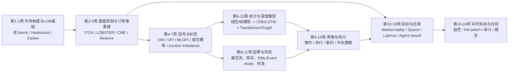
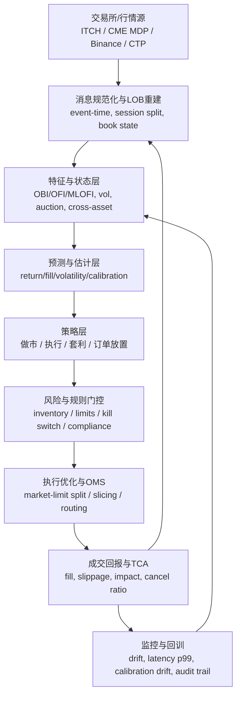

# 高频量化六个月系统追赶路线与前沿方法报告

## 执行摘要

这份报告按**高频量化的一般流程**来组织，而不是按学科分栏硬拆。原因很简单：高频量化真正有效的研究顺序，通常不是“先学模型”，而是“先弄对市场与数据，再把信号做成可交易对象，再决定模型、执行、回测、系统和合规”。公开文献与最新工具也在反复证明这一点：只看预测精度往往会高估策略价值；真正决定能否落地的是**消息级数据重建、队列位置与成交概率、成本与冲击、延迟与仿真真实性、以及监管约束**。Cont 系列关于 OFI 与 LOB 动态的工作、Almgren–Chriss/Avellaneda–Stoikov 的执行与做市框架、LOBFrame 对“预测强不一定可交易”的强调、以及 hftbacktest / ABIDES / JAX-LOB 对队列与延迟建模的重要性，都指向同一个结论：高频研究的核心是**微结构感知的端到端系统**，不是单一模型比赛。 citeturn7search10turn6search12turn6search16turn24search0turn8search6turn22search7turn33search0turn39search3

在你给定的约束下——默认读者具备中级量化/机器学习基础、每周投入约 15–20 小时、目标是 6 个月系统跟进——最优策略不是“广撒网读所有论文”，而是走一条**研究型主线 + 两到三个可复现项目**的路线：前 8 周把市场微结构、数据工程、信号与标签体系打牢；中间 8 周把统计/深度学习模型与执行/做市问题接上，并在带交易成本的仿真里验证；最后 8 周把回测与实时系统、监控、合规和审计链条补齐，同时完成一个偏预测、一个偏执行、一个偏系统的复现项目。这样做最接近当前公开研究和工业实践的交汇点。 citeturn30search6turn30search0turn12search8turn43search3turn43search1

本文明确使用如下假设。其一，**未指定市场**，所以研究核心覆盖订单驱动型市场中公开资料最丰富的三类：美股/欧股等股票市场、期货市场、中心化加密市场；外汇只在有直接来源的执行文献处点到为止。其二，**数据可得性默认以公开或学术可申请资源为主**，因此股票深度数据优先引用 LOBSTER、Nasdaq TotalView-ITCH、SEC 市场结构数据，期货优先 CME MDP，中心化加密优先 Binance/Bybit 官方流；中国市场的实操入口优先天勤 TqSdk 与 vn.py，而不是把“有全量 L3 付费接入”当成前提。其三，本文只推荐**正规来源**：原始论文、正式期刊/会议、交易所或监管文件、官方竞赛页面和开源仓库；不包含任何依赖操纵、打擦边监管、信息不对称的人肉方法。 

## 假设与研究流程总览

从流程上看，高频量化最稳妥的研究顺序可以写成：

$
\text{市场制度与数据} \rightarrow \text{特征与标签} \rightarrow \text{预测/估计模型} \rightarrow \text{风险与因果校正} \rightarrow \text{策略与执行} \rightarrow \text{回测/仿真} \rightarrow \text{实时系统与合规}
$

这里最关键的不是公式本身，而是每一步的“输出物”必须对下一步可用。比如，数据层的输出不是 CSV，而是**可重建、可对齐、可追溯的事件流与簿状态**；信号层的输出不是相关系数，而是**带明确 horizon、明确成本阈值、明确可执行性的标签体系**；模型层的输出不是 F1，而是**经过成本、队列、成交概率和风险约束校正过的决策分数**；执行层的输出不是中间价收益，而是**实现收益、成交率、冲击成本和库存风险共同定义的 PnL**。LOBFrame 的 2024 工作之所以重要，就在于它明确指出 LOB 预测中“传统 ML 指标不足以判断可交易性”，并提出了围绕完整成交概率的 operational evaluation。 citeturn8search6turn9search5turn29search7



如果把 6 个月再压缩成一句话：**先做“看懂簿”，再做“猜对短时方向/成交”，然后做“低成本把猜测变成单子”，最后做“保证系统、监管和伦理上可持续”**。这也是为什么我建议你的学习主线始终围绕三类项目展开：一个事件级预测项目、一个执行/做市项目、一个带延迟与队列的系统项目。公开竞赛也很适合拿来练这个闭环：Optiver Realized Volatility 强在微结构统计与 realized measures，Optiver Trading at the Close 强在竞价与 NOII/imbalance，Jane Street Real-Time Market Data Forecasting 强在在线更新、特征管线和实时推理约束。 citeturn17search4turn17search1turn19search3turn18search1turn18search2

## 流程前段

**数据与市场微结构**

核心问题是四件事：怎样从消息流重建订单簿；怎样理解价差、深度、队列与价格变化之间的关系；怎样区分连续竞价、开闭市集合竞价、不同场馆与不同 tick-size 制度；以及怎样把“书面上的 LOB 状态”变成真正可用于策略与执行的状态变量。经典与近五年的代表资源，建议按“制度—队列—冲击—现代微结构”来读：Harris 的 *Trading and Exchanges*（2003，OUP）讲交易参与者、场馆与规则；Hasbrouck 的 *Empirical Market Microstructure*（2007，OUP）是经验方法底座；Cont 与 de Larrard 的 *Price dynamics in a Markovian limit order market*（2011，arXiv，后被广泛用于队列模型）把最优买卖盘理解成可解析队列系统；Cont、Kukanov、Stoikov 的 *The Price Impact of Order Book Events*（2014，JFEC）说明短时价格变化主要由 OFI 驱动，且斜率与市场深度相关；Cont 与 Mueller 的 *A stochastic partial differential equation model for limit order book dynamics*（2021，SIAM JFM）把簿深与中间价放进统一的 SPDE 框架；Aquilina、Budish、O’Neill 的 *Quantifying the High-Frequency Trading “Arms Race”*（2022，QJE）用 message data 而非普通 LOB snapshot 量化延迟套利；Elomari-Kessab 等的 *Microstructure Modes*（2024，arXiv）则尝试用 PCA+VAR 从价格与订单流联合动态中抽取稳定模态。 citeturn12search1turn6search2turn6search12turn7search10turn23search4turn7search13turn23search1

这一层的方法路线图很清晰：最开始先学会 Level-1/2/3 的差别，随后从**snapshot 思维**切换到**event-time 思维**；再从价差、深度、队列不平衡等简单状态量出发，过渡到 OFI/MLOFI、响应函数、队列寿命、消息到达间隔；最后才进入 queue-reactive、Hawkes、SPDE、cross-asset OFI、auction dynamics 这类更现代的建模。对你这种有数学背景的人，真正值得吃透的是“为什么以时间为单位的 K 线直觉在高频里经常失效”，以及“为什么 price-time priority、tick size 和 order size 分布会直接决定 signal 的半衰期”。2024 年关于 queue-reactive 扩展到订单大小、2024 年 closing auction 的潜在流动性建模，以及 2025 年 LOB-Bench 对生成式 LOB realism 的基准，都是这条路线的前沿延伸。 citeturn23search6turn23search3turn34view0

常用数据与工具方面，股票侧最标准的研究级数据仍然是 LOBSTER 与 Nasdaq TotalView-ITCH；期货侧优先 CME MDP 的 market-by-order / market-by-price 文档；中心化加密侧优先 Binance 与 Bybit 的官方深度流；如果你想快速做中国期货/期权/股票接口级实践，TqSdk 和 vn.py 是最省时间的公开入口。公开系统层工具中，hftbacktest 适合做 market replay、队列位置和延迟模拟；ABIDES 适合做交互式 agent-based simulation；JAX-LOB 适合做 GPU 并行仿真与 RL 训练；Qlib 更适合作为研究管线、订单执行接口和实验管理层，而不是毫秒级撮合仿真器。最容易踩的坑包括：时间戳对齐错误、会话边界与集合竞价混入、corporate action 或换月没有正确处理、把深度快照误当 message-level truth、以及忽略隐藏流动性与失败报单。评估时，不要只看“是否预测对下一跳”；还要检查 spread、depth、inter-arrival、impact-response、queue-size 分布等 stylized facts 是否与真实市场相似。 citeturn45search0turn45search5turn19search0turn19search1turn19search5turn19search2turn22search1turn22search0turn10search3turn22search7turn33search0turn39search11turn43search1turn20search0

学习路径建议用 4–5 周完成。第一周读 Harris/Hasbrouck/Cartea 的市场制度与订单簿基础；第二到三周用一份 LOBSTER 或 Binance 深度流完成“重建簿 + 可视化 spread/depth/imbalance + 事件回放”；第四周复现 OFI/MLOFI 与 response function；第五周进入 queue-reactive / SPDE / 竞价机制。你真正要交付给自己的，不是一堆笔记，而是一个**可重建、可检查、可复用的数据层**。课程与书目上，Oxford 的 *Market Microstructure and Algorithmic Trading* 课程和 Georgia Tech 的 *Machine Learning for Trading* 可以分别承担“微结构理论”和“工程化研究流程”的角色。 citeturn30search6turn30search0turn12search8turn32search0

本层最新且正规的优先跟踪对象，我建议你放在三项上：一是 **LOB-Bench**（ICML 2025），因为它把“生成式 LOB 是否真实”这个以前很散的问题做成了统一基准；二是 **Microstructure Modes**（2024，预印本），因为它代表了从单指标走向“联合模态”的新方向；三是 **queue-reactive with order sizes**（2024，预印本），因为它在保持解释性的同时更接近真实簿流。前者是正式顶会论文，后两者是值得重点盯梢的学术前沿，但仍应视作“待进一步验证”的研究线。相关官方链接如下。 citeturn34view0turn23search1turn23search6

```text
https://proceedings.mlr.press/v267/nagy25a.html
https://arxiv.org/abs/2405.10654
https://arxiv.org/abs/2405.18594
```

**信号挖掘与特征工程**

高频信号的本质不是“找相关性”，而是把原始订单簿状态变成**更平稳、更可迁移、更贴近执行结果**的表示。最经典的对象是 top-of-book imbalance 与 OFI。若记买一卖一队列体量分别为$ \(V_t^{b,1},V_t^{a,1}\)$，则队列不平衡常写成
$
I_t=\frac{V_t^{b,1}-V_t^{a,1}}{V_t^{b,1}+V_t^{a,1}},
$
而 OFI 则是把限价单、撤单、成交等事件的供需变化在短窗内做有符号累加。Cont 等的研究说明 OFI 比单纯成交量更能解释短时价格变化；之后的多层 OFI 与 cross-impact OFI 进一步说明，把多个价位和多资产的信息汇总起来，比只看 best quote 更强。近五年里，这条路一方面走向更结构化的 fill probability / survival analysis，另一方面走向更跨资产、跨竞价机制的特征设计。 citeturn7search10turn7search11turn7search8

这一层的代表资源可以按“单资产微结构特征—多层聚合—成交概率—可解释执行特征”来读：Cont、Kukanov、Stoikov（2014，JFEC）是 OFI 的必读原点；Xu、Gould、Howison（2019，arXiv）提出 MLOFI，把多层价位一起纳入；Cont、Cucuringu、Zhang（2021，arXiv）表明 integrated OFI 能提升解释力，滞后 cross-asset OFI 对超短期预测有增益；Arroyo、Cartea、Moreno-Pino、Zohren 的 *Deep attentive survival analysis in limit order books*（2024，Quantitative Finance）把成交时间/成交概率建模正式推进到卷积-Transformer 生存分析；Fabre 与 Ragel 的 *Interpretable ML for High-Frequency Execution*（2023/2024，arXiv）则强调 fill probability 与 cleanup cost 必须一起估计，并且要避免“插入假想订单”的伪回测。竞赛上，Optiver *Trading at the Close* 官方任务直接把 closing auction 与 order book 结合起来，是训练 auction imbalance 特征与 intraday bucket 特征的好材料。 citeturn7search10turn7search11turn7search8turn27search3turn26search1turn17search1

技术路线建议你按“从稳态化到行动化”推进。先做最基本的价差、深度、top-level imbalance、微价格、signed volume；再做 OFI、MLOFI、rolling response、queue refill/cancel intensity；接着做 label 设计：是预测下一跳、未来 \(k\) 个 event 的 mid-price sign，还是预测在给定 horizon 内的 fill probability / survival function，抑或 closing cross 的相对偏离；最后才做 cross-asset feature、regime feature 和 market/limit order split 所需的 state vector。这里最大的坑是**标签泄漏**：高频里常见的 anchored/rolling horizon 标签如果和特征窗重合，会把未来信息不小心带回训练集；另一个坑是**评价错位**：F1 和 accuracy 很可能不错，但一考虑 spread、手续费、rebate、latency、未成交清扫成本，就完全不可交易。Briola 等 2024 的 operational framework 和 Arroyo 等 2024 的 survival-analysis 思路，都是在纠正这个问题。 citeturn8search6turn29search7turn27search3turn26search1

常用工具上，数据处理建议直接上 Polars/Pandas + Numba，特征工程优先接入 LOBFrame 的处理方式；实践数据优先选一份股票型 LOB 数据和一份更开放的加密深度流做双市场对照。评估指标建议从三组并行看：预测类指标看 macro-F1、balanced accuracy、MCC 或 Brier；交易类指标看 net hit rate、turnover-adjusted PnL、implementation shortfall；执行类指标看 fill rate、time-to-fill calibration、cleanup cost。对 6 个月目标而言，这一层最应该形成的能力是：**你能解释每个特征代表的微结构机制，而不是只会让 AutoML 选特征**。 citeturn33search3turn27search3turn26search1turn17search1

学习路径建议 3–4 周。第一阶段用一周把 imbalance、OFI、MLOFI、micro-price、realized-volatility 特征全部亲手写一遍；第二阶段用一周做不同 horizon 的 label 与 leakage 检查；第三阶段用一周做 fill probability / survival baseline；第四阶段拿 Optiver closing 或一只真实品种做小型特征 ablation。到这一层结束时，你至少要完成一个**成本感知的特征仓**。本层最值得优先跟踪的正规前沿，一是 **Deep attentive survival analysis in LOBs**（Quantitative Finance 2024），因为它把 fill probability 这件真正影响执行的任务做成了系统模型；二是 **Interpretable ML for High-Frequency Execution**（2024 版预印本），因为它把 fill probability 与 cleanup cost 放进同一执行决策；三是 **Forecasting High Frequency OFI**（2024，预印本），因为它往“直接预测 OFI 分布”迈了一步。 citeturn27search3turn26search1turn41search2

```text
https://arxiv.org/abs/2306.05479
https://arxiv.org/abs/2307.04863
https://arxiv.org/abs/2408.03594
```

**统计模型、机器学习与深度学习**

这一层要处理的核心不是“谁更深”，而是三件事：第一，模型的输入到底应该是原始 LOB、工程特征还是两者混合；第二，目标到底是下一跳分类、短窗 return forecasting、完整簿状态预测，还是不确定性/校准；第三，评价到底是纯预测还是带成本的 operational evaluation。经典线里，DeepLOB（2018/2019，arXiv）用 CNN + Inception + LSTM 把原始 LOB 学到可迁移表征；TransLOB（2020，arXiv/GitHub）把 transformer 引入 LOB；DeepVol（2022，arXiv）则提醒我们高频输入也很适合做波动率和风险预报，而不只是方向预测。近两年的重点则明显转向“大规模稳健基准、可行动评价、以及纯 transformer/图结构设计”。 citeturn33search13turn44search11turn28search0

近五年最值得读的代表作里，Briola、Bartolucci、Aste 的 *Deep Limit Order Book Forecasting*（2024，arXiv）非常关键，因为它一方面发布了 LOBFrame，另一方面明确指出“高预测能力并不自动等于可交易信号”；同一团队的 *HLOB*（2024，arXiv）把信息过滤网络和同调卷积思想引入 LOB；Berti 等的 **LiT: limit order book transformer**（2025，Frontiers in AI）代表“去卷积化”的纯 transformer 路线；Berti 与 Kasneci 的 **TLOB**（2025，arXiv）进一步把 dual attention 和更合理的标注法结合，指出许多旧标签本身带有 horizon bias；而 2025 年的 ICLR 投稿基准工作虽然尚未正式发表，但它的重要性在于把 LOB-specific 模型和一般时序模型放到统一 benchmark 里比较，并引入 mid-price return forecasting 任务。你在这一层最需要建立的判断力，是**何时该用强结构先验，何时该让模型自己学表征**。 citeturn8search6turn9search5turn9search0turn40search0turn40search10turn21view0

方法路线图可以粗分为四代。第一代是 logit/SVM/树模型配手工特征；第二代是 CNN/LSTM 类结构，如 DeepLOB；第三代是 CNN+Transformer 或 patch-based transformer，如 TransLOB、LiT；第四代是更强调解释性与结构归纳偏置的图/拓扑/多资产模型，如 HLOB、OF-MATNet 以及生成式 LOB 模型。对你而言，最现实的策略不是直接追第四代，而是先完成“线性/树模型 + engineered features”与“DeepLOB/TransLOB/简单 Transformer”两套基线，再做模型与标签、模型与成本、模型与市场体制之间的对照实验。因为高频里很多所谓“新 SOTA”其实是由标签定义、数据预处理或评估协议差异造成的。Briola 等 2024 和最新 benchmark 都明确提示了这一点。 citeturn8search6turn9search5turn40search0turn21view0turn38search0

实践上，开源代码优先看 LOBFrame、TransLOB、DeepLOB 复现仓库，以及中国市场新近出现的 LOBench/表示学习方向；数据上，FI-2010 仍适合做基准入门，但它是老数据、归一化强、市场单一，不应用来代替真实异构市场；如果你真的要做“六个月后能继续延伸”的路线，最好把 FI-2010 当作**模型调试集**，把 LOBSTER/实际深度流当作**研究集**。评估时建议同时记录 macro-F1、Brier/calibration、net PnL、turnover、持仓暴露、对 spread 宽度变化的鲁棒性；如果模型输出概率，还要做 reliability curve 与 threshold sweep。常见陷阱包括：过度依赖 FI-2010、忽略 class imbalance、没有比较资产间泛化、把未来 spread 变化间接泄漏到标签，以及把“预测中间价方向”误当“可以实盘成交获利”。 citeturn44search2turn44search10turn45search0turn8search6turn29search7

学习路径建议 5–6 周。第一阶段一周，把线性/LightGBM/MLP 在 OFI 类特征上跑通；第二阶段两周，复现 DeepLOB 与一个 transformer 基线；第三阶段一周，做 calibration、threshold 和交易成本敏感性分析；第四阶段一到两周，改写 loss 或标签，让目标从“方向预测”转向“净收益/完整成交概率/成本感知分类”。本层最新且正规的重点跟踪对象，我建议优先看 **LiT**（2025，同行评议期刊论文），再看 **LOB-Bench**（ICML 2025，虽然偏仿真/生成评估，但对模型评价体系极重要），最后将 **HLOB/TLOB** 作为要持续关注的预印本前沿。 citeturn40search0turn34view0turn9search0turn40search10

```text
https://www.frontiersin.org/journals/artificial-intelligence/articles/10.3389/frai.2025.1616485/full
https://proceedings.mlr.press/v267/nagy25a.html
https://arxiv.org/abs/2405.18938
https://arxiv.org/abs/2502.15757
```

## 流程中段

**因果与风险控制**

高频里的“因果”不是为了哲学上的纯粹，而是为了回答两个特别实用的问题：第一，你看到的信号到底是市场结构本身导致的，还是标签/执行/自反馈制造出来的伪相关；第二，当策略开始自己下单之后，原来训练时的统计关系还成立吗。高频里最重要的风险控制则有三类：**库存风险、逆向选择风险、制度/体制变换风险**。Lopez de Prado 与 O’Hara 的 VPIN 工作虽然年代较早，但把“毒性流”这个概念固定了下来；近年的工作则更偏向“部分信息下的毒性流卸载”“因果启发式迁移稳健性”“以及 fill probability + cleanup cost 的显式分解”。 citeturn7search4turn25search0turn11search13turn26search1

代表资源方面，经典底座建议用 Chernozhukov 等的 *Applied Causal Inference Powered by ML and AI*（2024，开放书稿）建立 DML / IV / DAG 的统一语言；在高频直接相关的文献里，Arroyo 等（2024，Quantitative Finance）把 fill probability 问题在方法上做成了有校准意义的 survival analysis；Fabre 与 Ragel（2023/2024，arXiv）强调 limit-or-market 决策必须同时考虑 fill probability 与 cleanup cost，并避免假想订单插入带来的选择偏差；Barzykin、Boyce、Neuman 的 *Unwinding Toxic Flow with Partial Information*（2024，arXiv）则把客户毒性流与内部化/外部化问题纳入部分可观测控制；而 *Data-driven measures of HFT*（2024，arXiv）从研究层面区分了供给流动性与需求流动性的 HFT 活动，为后续风险监测提供了更细的 proxy。 citeturn11search14turn27search3turn26search1turn25search0turn29search11

方法上，我建议你把“因果与风险”看成策略层前面的**过滤器**。先画一个最简单的 DAG：市场状态、你的订单、成交结果、价格变化、交易所规则与竞争对手行为之间谁影响谁；再把 event study、DML、分 regime 验证、概率校准和 inventory penalty 接上。很多高频项目失败，不是模型不会预测，而是训练数据是“未下单世界”，部署后却变成“会影响市场的世界”。因此这里的好路线，不是上来就追 causal discovery，而是先把三件事做扎实：**样本切片按 regime 分层、预测分数做概率校准、inventory/flow-toxicity 指标与主模型并联而不是事后补救**。评价时，除了 PnL，至少还要持续跟踪 inventory variance、drawdown、CVaR/ES、toxic fill rate、slippage tail、以及模型分数的 calibration drift。 citeturn11search14turn25search0turn29search11turn26search1

学习路径建议 3–4 周嵌入中段完成。第一周读因果总论并给自己的策略画 DAG；第二周做 event study 与分 regime 回测；第三周把预测概率变成 calibrated score，并接 inventory penalty；第四周在执行问题上尝试 fill probability / cleanup cost 或 toxicity-aware overlay。对 6 个月目标来说，这一层的“最新且正规”重点我建议看：**Deep attentive survival analysis**（正式期刊，直接对执行有用）、**Unwinding Toxic Flow with Partial Information**（贴近真实 desk 问题的前沿控制）、以及 **Data-driven measures of HFT**（对监测供需型 HFT 活动很有启发）。后两者目前更偏研究前沿，落地时要配合你自己的场景验证。 citeturn27search3turn25search0turn29search11

```text
https://causalml-book.org/
https://arxiv.org/abs/2407.04510
https://arxiv.org/abs/2405.08101
```

**交易策略与执行**

这一层才是高频量化真正“见钱”的地方，也最容易误入歧途。你要求“正规量化、不要散修方法”，我完全赞同；因此这里推荐的主线不是去碰灰色地带的纯延迟套利，而是**库存约束下做市、成本约束下最优执行、以及有明确微结构逻辑支撑的短时统计套利/跨市场执行**。经典框架必须牢：Almgren–Chriss（2001，最优执行的均值-方差基线）、Avellaneda–Stoikov（2008，库存风险驱动的做市基线）、Cont–Kukanov（订单放置/拆单优化）、Gatheral 的 no-dynamic-arbitrage 影响建模，以及 Cartea–Jaimungal–Penalva 的教材体系。 citeturn6search16turn24search0turn26search3turn13search0turn12search8

近年的代表作说明这个方向正在从“解析模型”走向“解析模型 + RL/仿真器 + 更强函数逼近”。Capponi、Figueroa-López、Yu 的 *Market Making with Stochastic Liquidity Demand*（2021，arXiv）把市场做市中随机需求、同步订单到达和价格预测合在一起；Kumar 的 *Deep Reinforcement Learning for High-Frequency Market Making*（ACML 2022，PMLR）用 DRQN 做高频做市；Jerome 等的 **mbt_gym**（ACM ICAIF 2023）为解析可控的 limit-order-book 问题提供了统一 RL 环境；Frey 等的 **JAX-LOB**（ACM ICAIF 2023）把 GPU 并行仿真落到了可用层；Briola 等的 *Deep Reinforcement Learning for Active High Frequency Trading*（2021，arXiv）给出端到端主动型高频交易基线；Li、Cucuringu、Sánchez-Betancourt、Willi 的 **Mixtures of Experts for Scaling up Neural Networks in Order Execution**（ACM ICAIF 2024）则把 MoE 引入 order execution；与此同时，Fabre 与 Ragel 2024、Eisler 与 Muhle-Karbe 2024、以及关于 passive impact / toxic flow 的新工作，都说明执行层正在变得更偏“可解释 ML + 经济约束”而不是纯黑箱。 citeturn13search1turn39search1turn10search8turn39search3turn9search2turn39search4turn26search1turn25search17turn25search1

技术路线图上，我建议把高频策略拆成三类来学。第一类是**做市**：先学 reservation price、optimal spread、inventory skew，再把 short-term alpha、queue risk、fill model 接入；第二类是**执行**：从 VWAP/TWAP/POV 到 limit-vs-market split，再到 transient impact、survival-based fill model、toxicity-aware execution；第三类是**统计套利/跨资产/跨场馆**：只做那些有明确微结构载体的，比如 closing auction imbalance、cross-asset OFI、期现/ETF–basket 的 order-flow 传导，而不是凭直觉拼因子。这里最该避免的坑包括：用中间价而不是真实成交价算收益、忽略 fee/rebate/tick-size、把“下单了但未成交”的机会成本漏掉、以及完全不建模 queue position。高频执行里，真正常用的目标函数通常都长得像
$
\max \;\mathbb{E}\text{PnL}] - \lambda \,\mathbb{E}[q_t^2] - \eta\,\text{ImpactCost} - \xi\,\text{NonFillCost},
$
只不过不同论文在 \( \lambda,\eta,\xi \) 的含义与动态上各有差别。 citeturn6search16turn24search0turn13search1turn26search1turn22search7

学习路径建议 5 周左右。先用两周把 Almgren–Chriss 和 Avellaneda–Stoikov 亲手推一遍，再用一周在 mbt_gym 或 JAX-LOB 里做 RL baseline，第四周接 fill probability / queue risk，第五周完成一个做市或执行的综合项目。你未来找实习时，最能打动人的不是“我复现了一个 transformer”，而是“我能把 fair price、inventory 和 fill probability 接成一条执行链，并在延迟与队列仿真中评估”。本层最新且正规的重点，我建议优先跟踪 **Mixtures of Experts for Scaling up Neural Networks in Order Execution**（ICAIF 2024）、**JAX-LOB**（ICAIF 2023）和 **mbt_gym**（ICAIF 2023）；如果你更偏理论，再跟 **Reinforcement Learning in High-frequency Market Making**（2024，预印本）与 **A theory of passive market impact**（2024，预印本）。 citeturn39search4turn39search3turn10search8turn9search14turn25search1

```text
https://dl.acm.org/doi/10.1145/3677052.3698691
https://github.com/KangOxford/jax-lob
https://github.com/JJJerome/mbt_gym
https://arxiv.org/abs/2412.07461
```

## 流程后段

**回测与实时系统**

高频研究里，回测不是研究的“最后一步”，而是研究是否可信的裁判。最经典的问题是：历史回放到底有没有考虑队列位置、消息级延迟、订单回执、网络抖动、场馆规则与你自己的订单对状态的反馈。*Get Real*（2020，AAMAS/ACM）把仿真 realism metric 系统化；ABIDES 提供了可扩展的 agent-based 离散事件模拟；JAX-LOB 让 GPU 大规模 RL 成为现实；2024 的 *Limit Order Book Simulations: A Review* 则把现有 LOB 仿真方法按方法论系统分类；2025 的 LOB-Bench 则把生成式市场仿真的“像不像真的市场”推进到正式 benchmark。它们共同说明，**高频回测要从 bar-based backtest 升级到 event-driven + queue/latency aware simulation**。 citeturn20search0turn33search0turn39search11turn20search2turn34view0

从系统架构上，一个研究级而非交易所托管级的 HFT 栈，建议你按下图去理解：数据接入、规范化与重建、特征与状态、预测与校准、风险/规则门控、执行优化、订单管理、成交回流、TCA 与回训监控，形成闭环。真正的工程难点通常不在“模型 forward 多快”，而在**消息一致性、状态同步、审计与可重放性**。hftbacktest 明确把订单队列与 feed/order latency 放进回测；Qlib 提供了从数据、模型、回测到 execution 的研究管线；FinRL-Meta 提供 data/environment/agent 三层生态；TqSdk 与 vn.py 则是中文环境下最容易上手的策略开发与回测框架。若做加密市场研究，cryptofeed 与 pybit 适合作为实时接入层。 citeturn22search7turn43search1turn43search2turn43search6turn22search8turn10search3turn22search2turn22search1



实践复现时，最容易踩的坑有六个。第一，把研究回测做成 K 线回测，完全失真；第二，假设订单“只要价格碰到就成交”，忽略 queue position；第三，只模拟下单指令，不模拟回执与撤单确认；第四，回测与实盘使用不同时间基准或不同撮合逻辑；第五，用一个市场/一只股票取得的参数直接移植到另一市场；第六，没有 shadow mode 与 replay mode。评估指标不能只停留在收益与 Sharpe；还要看 fill-simulation error、p50/p99 end-to-end latency、订单拒绝率、queue position drift、系统 downtime、和 TCA 漂移。公开的 систем工具里，hftbacktest 对“更真实的市场回放”最直接；ABIDES 对“交互式市场生态”最强；Qlib/FinRL-Meta 更像研究工作流与 agent 框架；TqSdk/vn.py 更偏中文实盘工程入口。 citeturn43search3turn43search10turn33search0turn20search0turn43search1turn22search8turn10search3

学习路径建议 4 周。第一周把 market replay 跑通；第二周加入 queue/latency 模型；第三周把研究代码改造成可重放、可审计的事件引擎；第四周做 shadow trading 与监控面板。最新且正规的重点跟踪对象，建议优先看 **LOB-Bench**（ICML 2025，用于评估生成式 LOB 仿真）、**JAX-LOB**（ICAIF 2023，GPU 仿真核心）、以及 **Generative AI for End-to-End LOB Modelling**（ICAIF 2023，生成 message flow 的代表工作）。如果你想继续往 2025–2026 追，则可关注 **ABIDES-MARL**，但目前仍是预印本。 citeturn34view0turn39search11turn35search9turn20search13

```text
https://proceedings.mlr.press/v267/nagy25a.html
https://github.com/KangOxford/jax-lob
https://github.com/abides-sim/abides
https://github.com/nkaz001/hftbacktest
```

**合规与市场伦理**

这一层不是附录，而是实盘前的硬门槛。中国监管已经把程序化交易与高频交易放到明面上体系化管理：证监会发布的《证券市场程序化交易管理规定（试行）》自 **2024 年 10 月 8 日**起实施，明确了程序化交易定义、**先报告后交易**、实时监控、机构合规风控、高频交易差异化监管等要求；上交所与深交所随后分别细化了实施细则，其中深交所通知明确自 **2025 年 7 月 7 日**起施行；期货侧，中金所 2025 年发布程序化交易管理办法，并明确“高频交易”的具体标准由交易所另行制定；到 2026 年，中金所对股指期权异常交易给出了更细的处理标准，例如某客户单日在某一合约上自成交达到 5 次、撤单达到 500 次，或大额撤单达到 100 次且单笔撤单量达到最大下单数量 80%，就会触发相应异常交易标准。这些阈值是**场馆和品种特定的**，不能机械外推。 citeturn14search0turn15search0turn14search2turn14search3turn15search3

原则层面，《证券法》要求证券交易活动遵守诚实信用原则，禁止欺诈、内幕交易和操纵证券市场；交易所异常交易监控细则又把自买自卖、频繁报撤单、影响正常交易秩序等行为纳入实时监控。因此，spoofing、layering、虚假申报、故意制造流动性假象、自成交冲量这些“看起来像高频技巧”的东西，在正规量化里都应直接排除。你在研究中也要注意**数据许可与用途边界**：像 LOBSTER 这类学术/商业数据平台有明确账号与使用限制；交易所深度数据、主机托管、跨市场的 direct market access 都伴随额外合同与技术控制要求。 citeturn31search0turn15search1turn15search2turn45search0

国际上，SEC 的 Rule 15c3-5 专门针对 automated rapid electronic trading 带来的市场接入风险，要求有市场接入的券商/经纪商配置合理的风险管理控制并实质上消除 naked access；EU MiFID II Article 17 及相关 RTS 进一步要求算法交易系统具备容量、阈值、错误单防护、unexecuted order to transaction ratio 监控，以及算法做市与场馆义务安排。换句话说，真正正规的高频系统，不只是“收益模型 + 执行器”，而是还包括**pre-trade checks、message-rate limits、price collars、self-trade prevention、kill switch、变更审批、审计日志与回放能力**。这也是为什么高频岗位面试里常问的不是“你会不会 transformer”，而是“你如何防 fat-finger / 自成交 / 失控撤单”。 citeturn16search2turn16search6turn16search12turn16search13turn16search9turn16search18

学习路径建议至少留 2 周，而且最好与系统搭建并行。第一周把中国证券/期货侧规则与自己要做的市场对应起来，做一张“策略行为—监管要求—系统控制”的矩阵；第二周把日志、限额、kill switch、order-to-trade ratio 监控、自成交预防做成模块。对这一层而言，“最新且正规”的优先资源不是论文，而是**最新正式监管文本**；如果你希望附加研究视角，再去看 2024 年关于 HFT activity measures 与毒性流建模的论文。 citeturn14search0turn14search2turn14search3turn15search3turn29search11turn25search0

```text
https://www.csrc.gov.cn/csrc/c101954/c7480579/content.shtml
https://www.szse.cn/lawrules/rule/trade/current/t20250403_612770.html
https://www.cffex.com.cn/cn/ssxz/20250808/44623.html
https://www.sec.gov/rules-regulations/2011/06/risk-management-controls-brokers-or-dealers-market-access
https://www.esma.europa.eu/publications-and-data/interactive-single-rulebook/mifid-ii/article-17-algorithmic-trading
```

## 核心资源与复现项目总表

下表把七个层面按你的学习目标压缩成“资源—代码—数据—时长”的对照卡片。注意，表中的学习时长是**建议有效时长**，不是把书和论文全文都读完的时长；默认你会边学边做项目，并且允许层间并行。表中的数据源单元格同时标注了适用市场。表中引用的资源大多来自官方书页、论文页、仓库或交易所文档。 citeturn12search8turn12search1turn6search2turn45search0turn19search0turn19search5turn19search2turn22search8turn10search3

| 层面 | 代表论文/书籍 | 开源代码 | 数据源 | 估计学习时长 |
|---|---|---|---|---|
| 数据与市场微结构 | Harris《Trading and Exchanges》；Hasbrouck《Empirical Market Microstructure》；Cont & de Larrard 2011；Cont & Mueller 2021；Aquilina et al. 2022 citeturn12search1turn6search2turn6search12turn23search4turn7search13 | ABIDES；hftbacktest citeturn33search0turn22search7 | LOBSTER（美股）；Nasdaq ITCH（美股）；CME MDP（期货）；Binance diff depth（加密） citeturn45search0turn19search0turn19search5turn19search2 | 4–5 周 |
| 信号挖掘与特征工程 | Cont et al. 2014 OFI；MLOFI 2019；Cross-Impact OFI 2021；Arroyo et al. 2024；Fabre & Ragel 2024 citeturn7search10turn7search11turn7search8turn27search3turn26search1 | LOBFrame；自建 Polars/Numba 特征仓 citeturn33search3turn8search6 | LOBSTER / FI-2010（股票）；Optiver Close（竞价） citeturn45search0turn44search2turn17search1 | 3–4 周 |
| 统计/机器学习模型 | DeepLOB；TransLOB；DeepVol；Deep LOB Forecasting；HLOB；LiT citeturn33search13turn44search11turn28search0turn9search5turn9search0turn40search0 | DeepLOB 复现；TransLOB；LOBFrame；TLOB 官方仓库 citeturn33search1turn44search11turn33search3turn40search5 | FI-2010（股票基准）；LOBSTER（股票研究） citeturn44search2turn45search0 | 5–6 周 |
| 因果与风险控制 | Applied Causal Inference Powered by ML and AI；Unwinding Toxic Flow with Partial Information；Data-driven Measures of HFT citeturn11search14turn25search0turn29search11 | 以自建 event study / DML pipeline 为主；无成熟 HFT 专用通用库占主导地位（这是公开生态的现状判断） citeturn11search14turn29search11 | 与主策略同市场；重点要求事件级日志与成交回报 citeturn25search0turn26search1 | 3–4 周 |
| 交易策略与执行 | Almgren–Chriss；Avellaneda–Stoikov；Capponi et al. 2021；Kumar 2022；MoE for Order Execution 2024 citeturn6search16turn24search0turn13search1turn39search1turn39search4 | mbt_gym；JAX-LOB；DRL for Active HFT citeturn10search8turn39search15turn9search3 | 股票/期货/加密均可；优先选择有全深度或近全深度流的品种 citeturn45search0turn19search5turn19search2 | 5 周 |
| 回测与实时系统 | Get Real；LOB Simulation Review 2024；LOB-Bench 2025 citeturn20search0turn20search2turn34view0 | hftbacktest；ABIDES；Qlib；FinRL-Meta；vn.py；TqSdk；cryptofeed citeturn22search7turn33search0turn43search1turn43search2turn10search3turn22search8turn22search2 | 与系统目标一致：股票/期货/加密；研究级优先 message/depth data citeturn19search0turn19search5turn19search2 | 4 周 |
| 合规与市场伦理 | CSRC 2024 程序化交易规定；深交所 2025 实施细则；中金所 2025/2026 规则；SEC 15c3-5；MiFID II Article 17 / RTS citeturn14search0turn14search2turn14search3turn15search3turn16search10turn16search12 | 风控/审计/限额模块以自建为主，配合 OMS/日志系统 | 法规不区分“研究数据”，但实盘接入、报备、审计与异常交易标准均与市场/场馆绑定 citeturn14search0turn14search3turn16search12 | 2 周 |

下表是我更推荐你真正去做的复现项目清单。项目排布遵循“从预测到执行再到系统”，这样你在 6 个月结束时，不会只留下几份 notebook，而是能展示一条完整研究链。 citeturn17search1turn18search1turn22search7turn39search15

| 项目名称 | 目标 | 难度 | 所需数据 | 关键实现点 | 预期评估指标 | 参考论文/代码 |
|---|---|---|---|---|---|---|
| OFI 与 MLOFI 事件级基线 | 用 OFI/MLOFI 预测未来 \(k\) 个 event 的 mid-price sign，并做成本敏感评估 | 低 | Binance 深度流或 LOBSTER/FI-2010 | 事件驱动重建；窗口标签；leakage 检查；threshold sweep | macro-F1、Brier、净 hit rate、spread 后净收益 | Cont et al. 2014；MLOFI 2019 citeturn7search10turn7search11 |
| DeepLOB / TransLOB / LiT 对照实验 | 比较 handcrafted features 与深度表征谁更稳健、谁更可交易 | 中 | FI-2010 + 一份真实深度流 | 统一预处理；统一标签；calibration；交易成本回放 | macro-F1、calibration、turnover-adjusted PnL | DeepLOB；TransLOB；LiT；LOBFrame citeturn33search13turn44search11turn40search0turn33search3 |
| Fill Probability 与 Limit-vs-Market 决策 | 做一个 survival-based 成交概率模型，并用于下单方式选择 | 中 | L3 或高频成交回报数据 | 生存分析；cleanup cost；执行规则；不插入假想订单 | time-to-fill calibration、IS、未成交清扫成本 | Arroyo et al. 2024；Fabre & Ragel 2024 citeturn27search3turn26search1 |
| Avellaneda–Stoikov 做市 + 短时 alpha | 在库存约束下加入 OFI/微价格 alpha，评估库存与逆向选择 | 中 | 单一高流动品种深度流 | fair price、inventory skew、queue-aware fills、费用/返佣 | realized spread、inventory variance、net PnL、toxic fill rate | Avellaneda–Stoikov；hftbacktest tutorial citeturn24search0turn22search7 |
| mbt_gym / JAX-LOB 上的 RL 执行实验 | 在可控仿真器中训练执行 agent，并与 TWAP/POV/解析基线比较 | 中高 | 仿真数据或校准后的真实参数 | 环境校准、奖励函数、risk penalty、out-of-regime test | implementation shortfall、CVaR、参与率约束下收益 | mbt_gym；JAX-LOB；MoE execution citeturn10search8turn39search15turn39search4 |
| Optiver Closing Auction 项目 | 学会处理 closing imbalance、auction data 与 intraday bucket 特征 | 中 | Kaggle Optiver Trading at the Close | 竞价特征、bucket 聚合、在线推理限制 | rank/correlation、竞价窗口净收益模拟 | 官方竞赛页 citeturn17search1 |
| Jane Street 实时预测工程化项目 | 训练实时推理管线，强调内存、在线更新与监控 | 中高 | Kaggle Jane Street Real-Time Market Data Forecasting | 分块读取、在线特征、模型集成、推理延迟 | 竞赛 utility / 自定义交易指标、推理耗时 | 官方竞赛页；开源解法仓库 citeturn18search1turn18search8 |
| 队列与延迟感知的实盘前 shadow 系统 | 把研究策略接成可回放、可审计、可限额的 shadow trading 栈 | 高 | 实时行情 + 自己的订单日志 | OMS、kill switch、drop-copy/回报记录、异常监控 | p99 延迟、order reject rate、审计可回放性 | hftbacktest；Qlib；TqSdk；vn.py citeturn43search3turn43search1turn22search8turn10search3 |

最后给出一个可执行的 24 周主线。第 1–4 周：市场制度、订单簿、数据接入与重建；第 5–8 周：OFI/MLOFI、标签、特征仓、线性/树模型；第 9–12 周：DeepLOB/Transformer/波动率与 fill probability；第 13–16 周：做市、执行、RL 仿真；第 17–20 周：market replay、queue/latency、监控与 shadow mode；第 21–24 周：合规矩阵、审计链、完成 2–3 个 portfolio-ready 项目。每周 15–20 小时足够做成一套**研究可展示、代码可复现、方向可继续深化**的高频路线，但前提是你始终围绕“从信号到执行的闭环”推进，而不是陷在局部指标优化里。 citeturn8search6turn22search7turn14search0

**开放问题与局限**

这份报告有三点局限我需要明确写出。第一，公开高频研究仍然**明显偏股票与学术数据平台**，期货与中国本土 L3 公开基准相对弱一些；第二，2024–2026 的不少前沿模型（尤其是 HLOB、TLOB、ABIDES-MARL、若干 execution/impact 新论文）仍是预印本或会议论文，工程上应当“跟踪但不盲信”；第三，竞赛数据与真实交易数据之间永远存在制度与反馈差异，所以本文把 Kaggle/竞赛放在“练工程与特征”的位置，而不是代替真实高频市场研究。你如果后续要进一步窄化方向，我最推荐的两个分支是：**微结构预测 + 成交概率/执行**，或者**做市/执行 + 队列与延迟仿真**；这两条线最容易在 6 个月内形成真正有说服力的作品。 